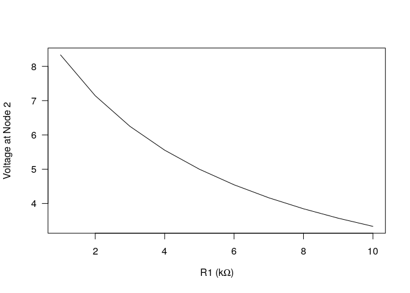
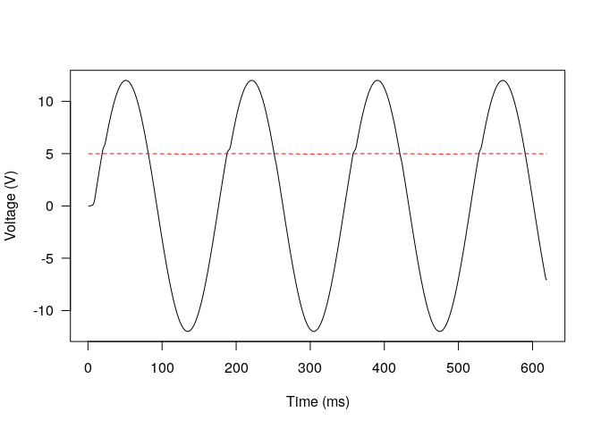

<!-- README.md is generated from README.Rmd. Please edit that file -->

1.  RSpice Background

2.  Compilation of Ngspice as Shared Library

3.  Installation of *RSpice*

4.  Examples

## 1 - Background

RSpice provides an interface to allow users to run ngspice, a popular
open source electronic circuit simulator, in R via a ngspice shared
library (or dynamic linked library on Windows). RSpice provides
functions to specify and modify the electronic circuit and its inputs to
obtain simulation results and other feedback from ngspice. By using the
*RSpice* package, it is possible to perform statistical analysis on the
outputs from ngspice.

## 2 - Compilation of Ngspice as Shared Library

There are two different ways to obtain an ngspice shared library: 1)
compile from the source code, which is available from the
developers/maintainers or 2) download the ready-to-use shared library
and related files from the links provided in Section **2.2**.

### 2.1 - Compile from the source code

Visit
<https://sourceforge.net/projects/ngspice/files/ng-spice-rework/28> and
download the source code of ngspice in the tarball file
**ngspice-28.tar.gz**. One can compile the ngspice source code to
generate a shared library with extension *.so* (or *.dll*) depending on
the operating system. It is recommended to install the released stable
version of ngspice from the referred tarball instead of installing
directly from the github repository of ngspice.

#### 2.1.1 - Compile the source code for UNIX/Linux systems

  - Unpack the tarball by **tar -zxvf ngspice-28.tar.gz** or some
    customized commands under your operating system, to produce a folder
    with name *ngspice-28*.

  - Change the directory to *ngspice-28* by using **cd ngspice-28**.

  - In order to keep the working tree clean, make a sub directory to
    work on, for example, if we would like to work within a sub
    directory *ngspice-shared*, then at the command line, we could do,

<!-- end list -->

1.  $ mkdir ngspice-shared
2.  $ cd ngspice-shared
3.  $ ../configure –enable-xspice –enable-cider –disable-debug
    –with-ngshared
4.  $ make
5.  $ sudo make install

The default installation path is */usr/local/bin*, */usr/local/man*,
etc. The installation path prefix could be modified from */usr/local* to
a customised path by giving the *configure* comand in step 2 an option
*–prefix=PATH*. See Section 1 of the *INSTALL* file in the unpacked
tarball folder (*ngspice-28*) for more details on the options for
*configure* .

#### 2.1.2 - Compile the source code for Windows systems

There are multiple ways to compile the ngspice source code into a
dynamic linked library (dll) for Windows systems:

1.  If visual studio is installed, go to the directory *visualc* of the
    unpacked tarball and start the project by double clicking on
    *sharedspice.vcxproj*. The *.dll* will be built by building the
    project.
2.  It is also possible to compile the ngspice shared library for
    Windows on a Linux machine by simply running the script
    *cross-compile-shared.sh* within the tarball folder.

See Chapter 32 of the Ngspice user manual at
<http://ngspice.sourceforge.net/docs/ngspice-manual.pdf> for more
details and options for the compilation of ngspice.

### 2.2 - Ready-to-use Compiled Shared Libraries

There are also compiled shared library available for download and use:

  - For Windows 64-bit systems, download the zip file from
    <https://github.com/QianqianShan/CompiledNgspice/tree/master/dll64>
    and unzip it into the C drive.

  - For Windows 32-bit systems, download the zip file from
    <https://github.com/QianqianShan/CompiledNgspice/tree/master/dll32>
    and unzip it into the C drive.

  - For \*unix 64-bit systems, download files and folders from
    <https://github.com/QianqianShan/CompiledNgspice/tree/master/so64>.
    Copy the files in lib folder to */usr/local/lib*, copy the *ngspice*
    folder to */usr/local/share*.

  - For \*unix 32-bit systems, similar to above, download
    <https://github.com/QianqianShan/CompiledNgspice/tree/master/so32>.
    Copy the files in lib folder to */usr/local/lib*, copy the *ngspice*
    folder to */usr/local/share*.

## 3 - Installation

RSpice can be installed from CRAN with (not available at this moment):

``` r
install.packages("RSpice")
```

A package bundle of RSpice is available at
<https://github.com/QianqianShan/RSpiceBundle>. Download the *.tar.gz*
file and install the
package:

``` r
install.packages(/path/to/the/bundle/pkgname, repos = NULL, type = "source")
# for example
install.packages("~/Downloads/RSpice_1.0.0.tar.gz", repos = NULL, type = "source")
```

You can also install RSpice from github with:

``` r
# install.packages("devtools")
devtools::install_github("QianqianShan/RSpice")
```

## 4 - Examples

The following code demonstrates the use of RSpice with two built-in
circuit netlists (a netlist, in ngspice jargon, provides the
specification of an electronic circuit). See the vignette for more
details on the following examples and more examples.

``` r
# load the library
library(RSpice)
#########################
# example 1 : toyexample 
#########################
# list the netlist of the toyexample 
toyexample
#> [1] ".title toyexample" "R1 1 2 5k"         "R2 2 0 5k"        
#> [4] "VDD 1 0 DC 10"     ".op"               ".end"

# or equivalently, define the circuit in R or read it from local file
# the netlist must start with a .title line and end with .end
toyexample <- c(".title test ", "R1 1 2 5k", "R2 2 0 5k",
                "VDD 1 0 DC 10", ".op", ".end")

# initialize ngspice and load the circuit 
circ <- circuitLoad(toyexample)
#> The default path for Ngspice shared library: /usr/local/lib is searched.
#> The default dylibname for ngspice shared library libngspice is searched.
#> Your are using 64-bit R version, please make sure your Ngspice shared library is 64-bit too.
#> Searching for standard configuration file, spinit, at /usr/local/share/ngspice/scripts 
#>  File located. 
#>  
#> Searching default path for the code models for XSPICE at /usr/local/lib/ngspice 
#> File located. 
#>  
#> Initializing ngspice now...
#> /usr/local/lib/libngspice.so loaded successfully. 
#> stdout ******
#> stdout ** ngspice-28 shared library
#> stdout ** Creation Date: Wed Nov  7 11:10:32 CST 2018
#> stdout ******
#> Ngspice has already been initialized, load circuit now. 
#> Source Deck
#> stdout Circuit: test 
#> Prepare Deck
#> Circuit2
#> stdout test 
#> stdout 1 : test 
#> stdout 2 : .global gnd
#> stdout 3 : r1 1 2 5k
#> stdout 4 : r2 2 0 5k
#> stdout 5 : vdd 1 0 dc 10
#> stdout 6 : .op
#> stdout 8 : .end

# run the simulation in mainthread 
runSpice()

# list the output names and their corresponding stored order: locations 
PlotNames <- getPlotNames()
PlotNames
#>   location       Name
#> 1        1 vdd#branch
#> 2        2       V(2)
#> 3        3       V(1)

# Find the length of the variables (plot names)
data.length <- getLength()
data.length
#> [1] 1

# generate a vector of commands to be sent to Ngspice
r1.values <- paste0(seq(1, 10, 1), "k")
cmds <- paste0("alter r1=", r1.values)
print(cmds)
#>  [1] "alter r1=1k"  "alter r1=2k"  "alter r1=3k"  "alter r1=4k" 
#>  [5] "alter r1=5k"  "alter r1=6k"  "alter r1=7k"  "alter r1=8k" 
#>  [9] "alter r1=9k"  "alter r1=10k"

# alter the resistance values from 1k to 10k Ohms. 
# send the command to ngspice via spiceCommand()
v2 <- double(length(cmds))
for (i in 1:length(r1.values)) {
spiceCommand(cmds[i])   # send commands one by one 
runSpice()  # run the simulation 
v2[i] <- exportResults(c(2)) # export the voltage at node 2 (location = 2)
}
print(v2)
#>  [1] 8.333333 7.142857 6.250000 5.555556 5.000000 4.545455 4.166667
#>  [8] 3.846154 3.571429 3.333333


# plot the voltages at node 2 as a function of resistance
plot(seq(1, 10, 1), v2, xlab = expression(paste( "R1 (k", Omega,")" )),
     ylab = "Voltage at Node 2", pch = 16, las = 1, type = "l")
```

<!-- -->

``` r

#################################################
# example 2 : linear regulator: power supply with
# 12 volts AC input and 5 volts DC output
#################################################

# linear regulator circuit netlist 
linearregulator
#>  [1] ".title Linear Regulator Modified from P. Basso: Switched-Mode Power Supplies, 2008, Chapter 1"
#>  [2] "Q1 2 1 5 QN2222"                                                                              
#>  [3] ".MODEL QN2222 NPN BF=105 BR=4 CJC=12.2P CJE=35.5P IKF=.5"                                     
#>  [4] "+ IKR=.225 IS=15.2F ISE=8.2P NE=2 NF=1 NR=1 RB=1.49 RC=.149"                                  
#>  [5] "+ RE=.373 TF=500P TR=85N VAF=98.5 VAR=20 XTB=1.5"                                             
#>  [6] "*Vin 2 0 DC=12"                                                                               
#>  [7] "Vin 2 0 sin(0 12 60 0 0)"                                                                     
#>  [8] "E1 1 0 3 4 10k"                                                                               
#>  [9] "Vref 3 0 DC=2.5"                                                                              
#> [10] "Rlower 4 0 10k"                                                                               
#> [11] "Rupper 5 4 10k"                                                                               
#> [12] "Rload 5 0 100"                                                                                
#> [13] ".tran 0.1m 0.06"                                                                              
#> [14] ".END "

# as ngspice has been initialized from the above example, the circuitLoad function will only load the circuit, and dylibpath and dylibname are not needed.
circuitLoad(linearregulator)
#> Ngspice has already been initialized, load circuit now. 
#> Source Deck
#> stdout Circuit: Linear Regulator Modified from P. Basso: Switched-Mode Power Supplies, 2008, Chapter 1
#> Prepare Deck
#> Circuit2
#> stdout Linear Regulator Modified from P. Basso: Switched-Mode Power Supplies, 2008, Chapter 1
#> stdout 1 : linear regulator modified from p. basso: switched-mode power supplies, 2008, chapter 1
#> stdout 2 : .global gnd
#> stdout 3 : q1 2 1 5 qn2222
#> stdout 4 : .model qn2222 npn bf=105 br=4 cjc=12.2p cje=35.5p ikf=.5 ikr=.225 is=15.2f ise=8.2p ne=2 nf=1 nr=1 rb=1.49 rc=.149 re=.373 tf=500p tr=85n vaf=98.5 var=20 xtb=1.5
#> stdout 6 : vin 2 0 sin(0 12 60 0 0)
#> stdout 7 : e1 1 0 3 4 10k
#> stdout 8 : vref 3 0 dc=2.5
#> stdout 9 : rlower 4 0 10k
#> stdout 10 : rupper 5 4 10k
#> stdout 11 : rload 5 0 100
#> stdout 12 : .tran 0.1m 0.06
#> stdout 14 : .end

# run the simulation 
runSpice()

# Plotnames 
PlotNames<-getPlotNames()
PlotNames
#>   location        Name
#> 1        1  vin#branch
#> 2        2 vref#branch
#> 3        3   e1#branch
#> 4        4        V(4)
#> 5        5        V(3)
#> 6        6        V(5)
#> 7        7        V(1)
#> 8        8        V(2)
#> 9        9        time

# data length 
data.length<-getLength()
data.length
#> [1] 619

# export the input and output voltages from location 8 and 6, respectively. 
results <- exportResults(c(8, 6))
results[1:2, 1:10]
#>       [,1]        [,2]        [,3]       [,4]       [,5]       [,6]
#> 8 0.000000 0.004523893 0.009047786 0.01809557 0.03619109 0.07238186
#> 6 4.988793 4.988801568 4.988810594 4.98882865 4.98886475 4.98893697
#>        [,7]      [,8]      [,9]    [,10]
#> 8 0.1447611 0.2895011 0.5788337 1.030178
#> 6 4.9890814 4.9893702 4.9899475 4.990848

# visualize the results 
plot(c(1, data.length), c(min(results), max(results)), type = "n",
     xlab = "Time (ms)", ylab = "Voltage (V)", las = 1)
for (i in 1:2) {
  lines(results[i, ], col = i, lty = i)  
}
```

<!-- -->

``` r

# unload Ngspice shared library
unloadSpice()
#> Ngspice shared library unloaded.
```
